<p align="center">
  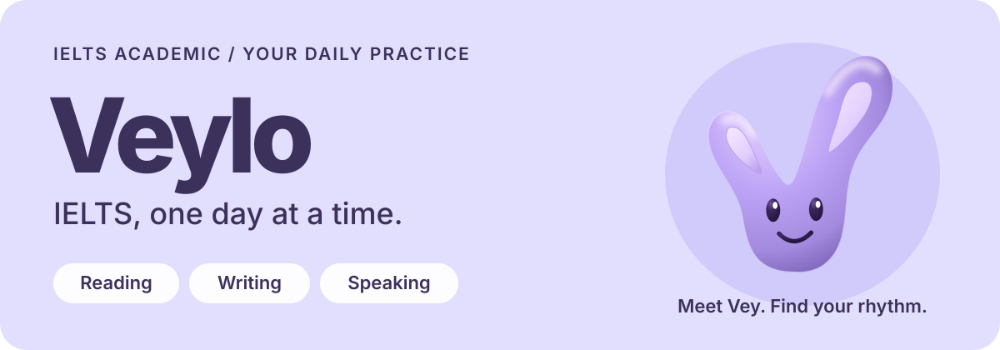
</p>

<p align="center">
  <a href="#how-to-install">Install</a> ·
  <a href="#inside-veylo">Features</a> ·
  <a href="#iphone-and-mac-designs">iPhone & Mac designs</a> ·
  <a href="#ios-preview">iOS preview</a> ·
  <a href="#architecture">Architecture</a> ·
  <a href="#tech-stack">Tech stack</a> ·
  <a href="#documentation">Documentation</a>
</p>

**Veylo is a workspace for IELTS Academic preparation.** Practise with tasks, save drafts, build speaking confidence with Vey, and return each day to earn another flame. The repository includes the web app and an interactive SwiftUI iOS preview. The iOS preview works with local demo data; connecting it to the backend is the next stage. macOS has a separate starter project.

<a href="assets/readme/reading-desktop.png">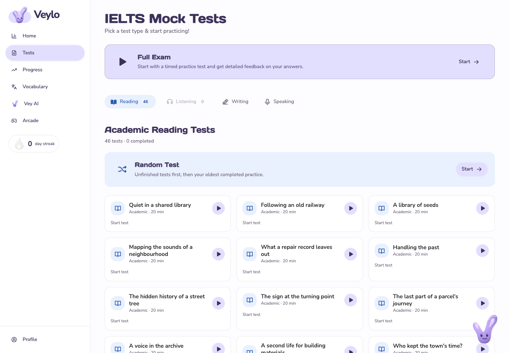</a>

<sub>Real interface, Chrome, test account. Click a screenshot to view it at full size.</sub>

## iPhone and Mac designs

Five matching screen pairs exported from [`design.pen`](design.pen). These are **design previews**, not screenshots of shipped native features; the macOS app is currently a starter project. Click either image for the full-size view.

### Sign in

Email and Google sign-in, password recovery and a familiar welcome from Vey.

<table>
  <tr><th width="25%">iPhone</th><th width="75%">macOS</th></tr>
  <tr>
    <td valign="top"><a href="assets/readme/native/sign-in-iphone.png">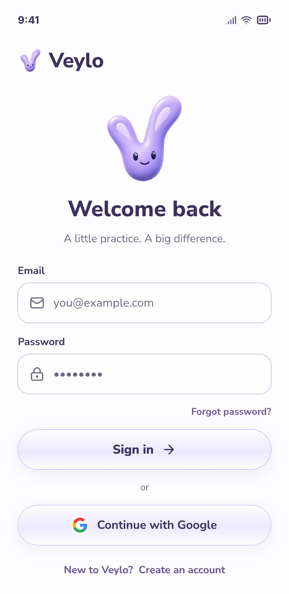</a></td>
    <td valign="top"><a href="assets/readme/native/sign-in-macos.png">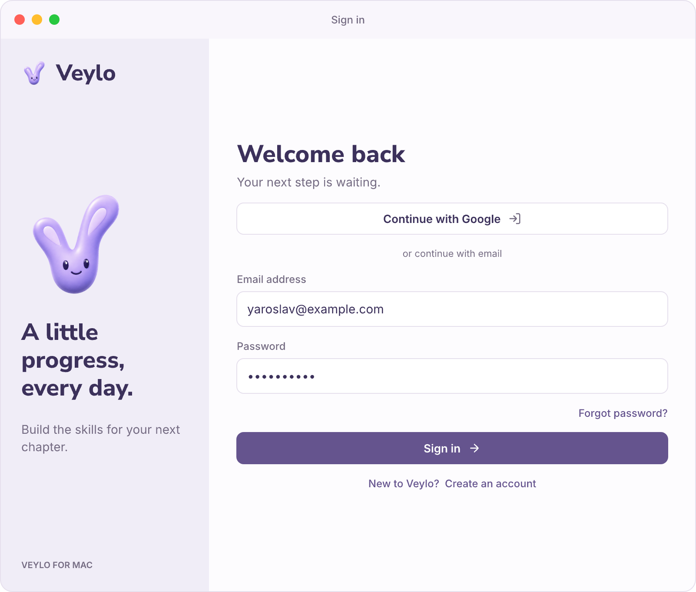</a></td>
  </tr>
</table>

### Dashboard

A daily study plan, a target band and a learning streak. Mac adds room for skill estimates and the next recommended task.

<table>
  <tr><th width="25%">iPhone</th><th width="75%">macOS</th></tr>
  <tr>
    <td valign="top"><a href="assets/readme/native/dashboard-iphone.png">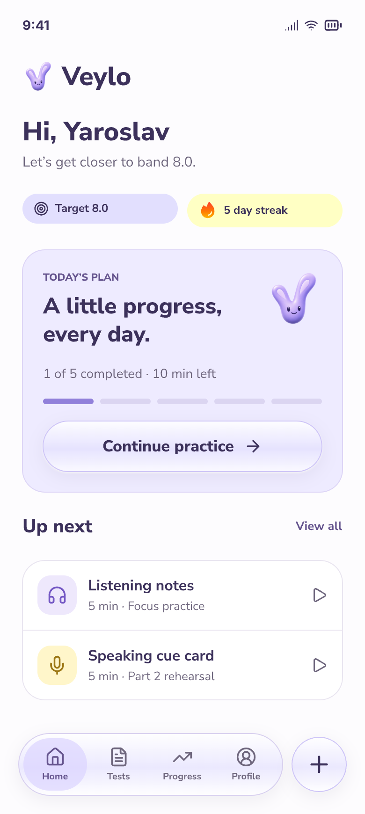</a></td>
    <td valign="top"><a href="assets/readme/native/dashboard-macos.png">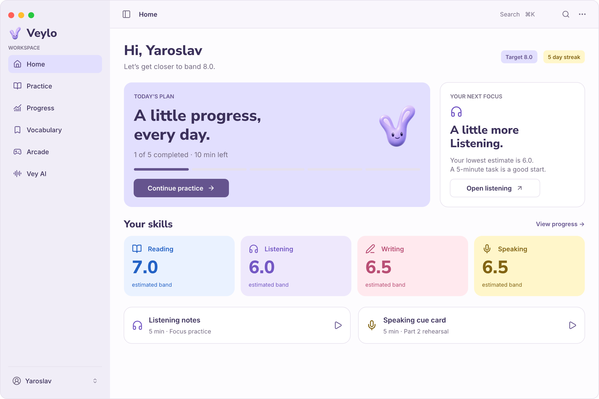</a></td>
  </tr>
</table>

### Practice

Choose a skill and start practising. iPhone uses a compact catalogue; Mac presents the skill areas in a wider workspace.

<table>
  <tr><th width="25%">iPhone</th><th width="75%">macOS</th></tr>
  <tr>
    <td valign="top"><a href="assets/readme/native/practice-iphone.png">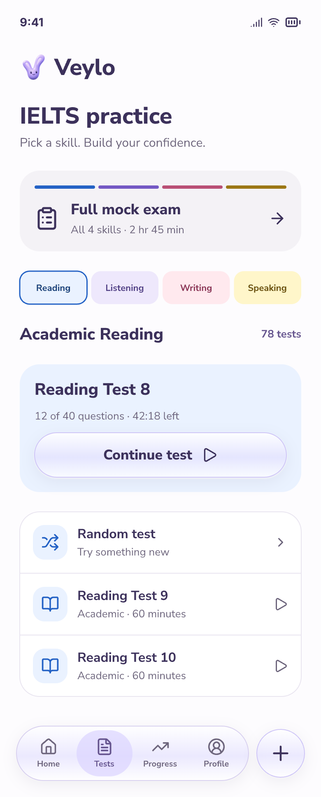</a></td>
    <td valign="top"><a href="assets/readme/native/practice-macos.png">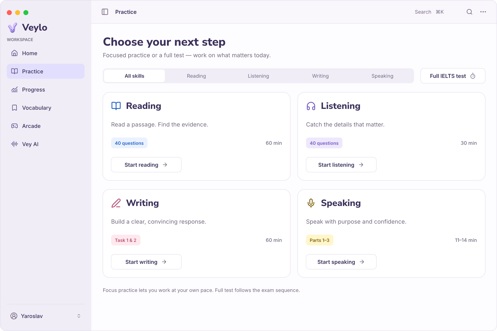</a></td>
  </tr>
</table>

### Progress

Review estimated band progress, the forecast and individual skills. These sample estimates are not official IELTS results.

<table>
  <tr><th width="25%">iPhone</th><th width="75%">macOS</th></tr>
  <tr>
    <td valign="top"><a href="assets/readme/native/progress-iphone.png">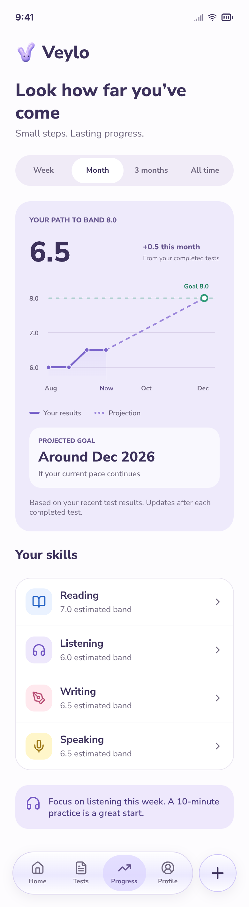</a></td>
    <td valign="top"><a href="assets/readme/native/progress-macos.png">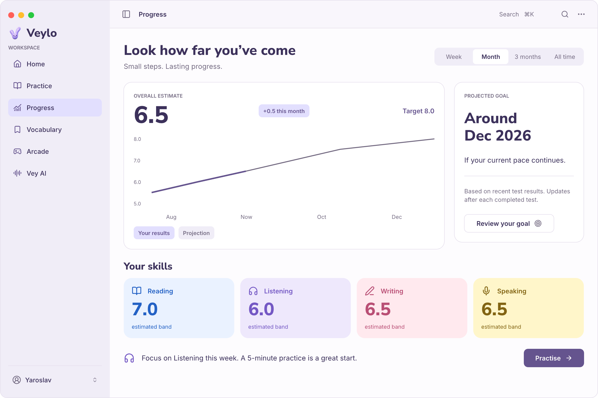</a></td>
  </tr>
</table>

### Chat with Vey

Work through an IELTS answer with the coach. iPhone focuses on one conversation; Mac keeps conversation history alongside it.

<table>
  <tr><th width="25%">iPhone</th><th width="75%">macOS</th></tr>
  <tr>
    <td valign="top"><a href="assets/readme/native/vey-chat-iphone.png">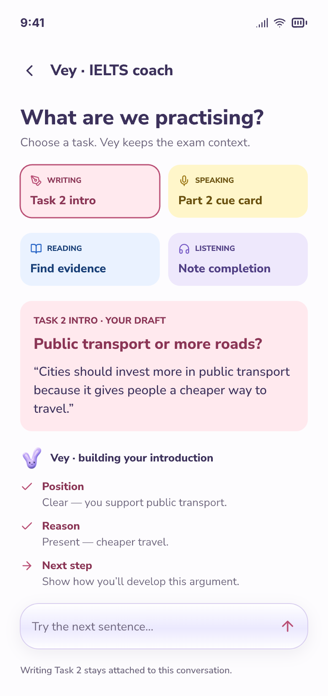</a></td>
    <td valign="top"><a href="assets/readme/native/vey-chat-macos.png">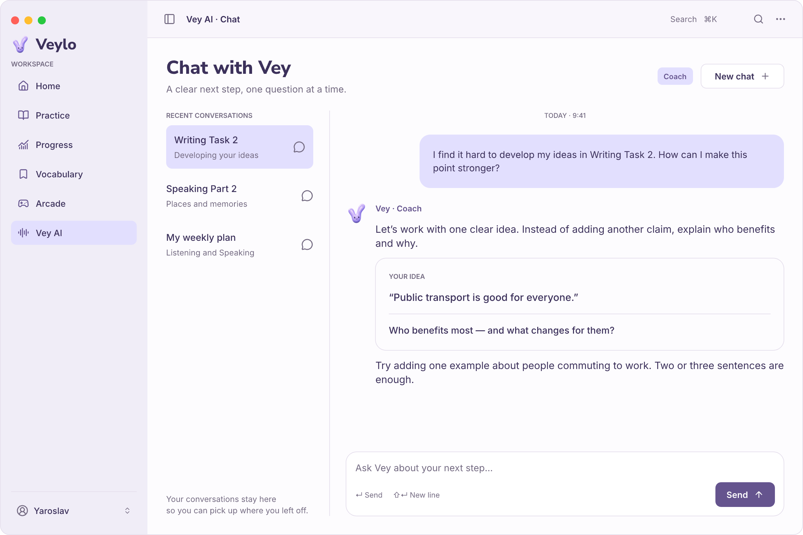</a></td>
  </tr>
</table>

## Inside Veylo

| Area                  | What you can do                                                                                                                      |
| --------------------- | ------------------------------------------------------------------------------------------------------------------------------------ |
| **Practice**          | Choose Reading, Writing and Speaking tasks; save drafts, resume after a reload, and review Reading results.                          |
| **Vey AI**            | Choose a conversation partner's personality and practise speaking. Vey listens, speaks, changes expressions and follows your cursor. |
| **Vocabulary**        | Review words by topic, take quizzes and build a personal word bank.                                                                  |
| **Daily flame**       | Complete activities and maintain a streak in your own time zone.                                                                     |
| **Progress & Arcade** | Track your practice history and train through short game rounds.                                                                     |

### One Vey, different personalities

<a href="assets/readme/vey-ai-desktop.png">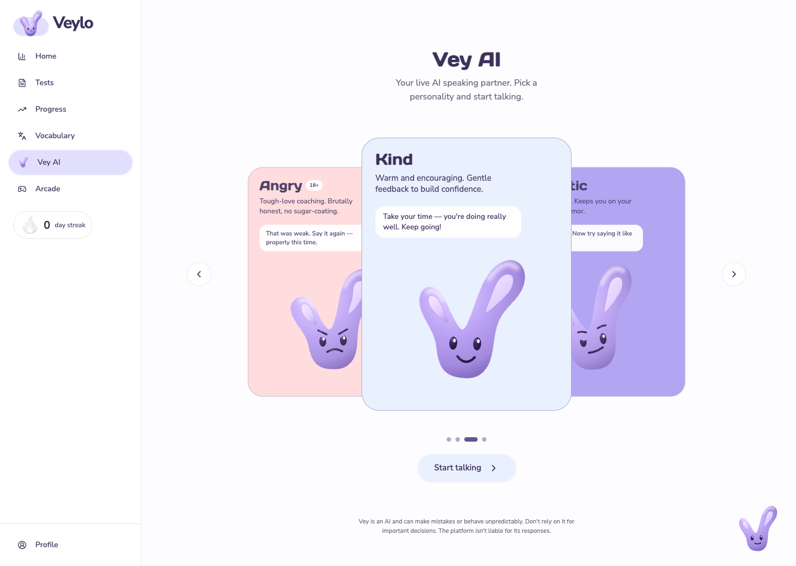</a>

<details>
<summary><strong>More screenshots: daily plan, vocabulary and mobile views</strong></summary>

#### Daily plan and learning flames

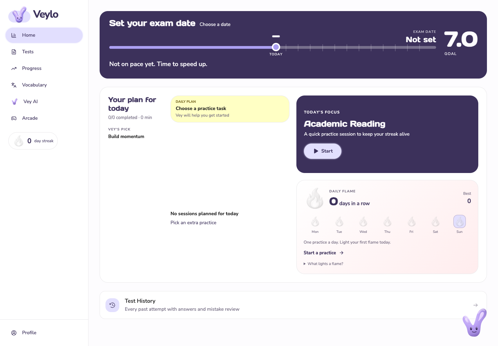

#### Vocabulary

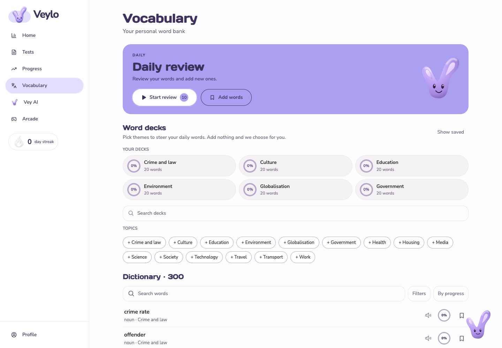

<p align="center">
  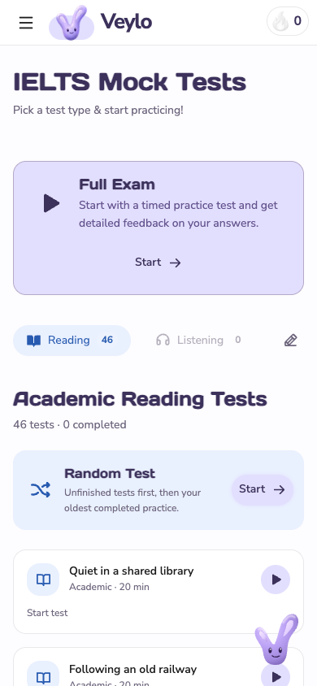
  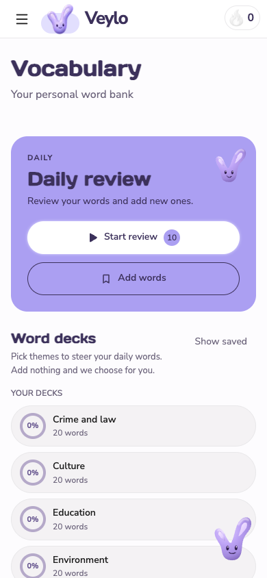
  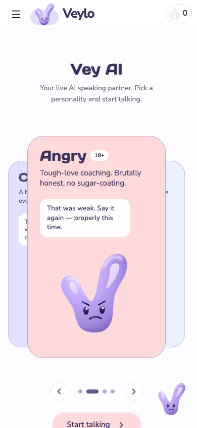
</p>

</details>

### Practice bank

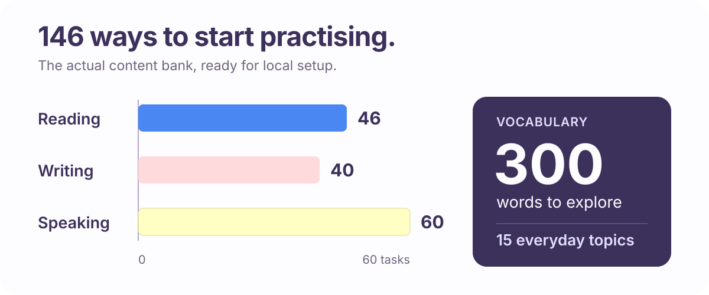

The repository includes **146 tasks: 46 Reading, 40 Writing and 60 Speaking**, plus **300 words across 15 topics**. Reading covers 14 question formats. These figures describe the local content bank. The [content validator](apps/web/scripts/validate-content.ts) checks structure, answer keys and supporting quotations.

### How a flame is earned

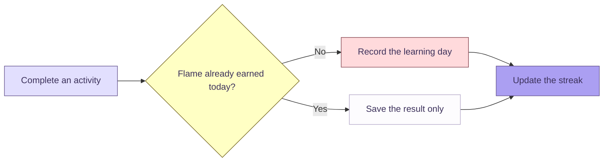
```mermaid
flowchart LR
    A[Complete an activity] --> B{Flame already earned today?}
    B -->|No| C[Record the learning day]
    B -->|Yes| D[Save the result only]
    C --> E[Update the streak]
    D --> E
    style A fill:#e2dffe,stroke:#65548e,color:#3c315b
    style B fill:#ffffc4,stroke:#74651f,color:#3c315b
    style C fill:#ffdadc,stroke:#864751,color:#3c315b
    style D fill:#fdfcfe,stroke:#b5a9c9,color:#3c315b
    style E fill:#ab9ff2,stroke:#65548e,color:#3c315b
```

Qualifying activities include a submitted practice attempt or quiz, a completed game round, or three nonempty learner replies in one conversation on the same day. A flame does not require successful AI grading. Missing an entire day resets the current streak; the best streak is preserved. [Read the full rules](docs/daily-streak.md).

## How to install

### Web app

You need **Node.js 24.17.0**, **pnpm 11.19.0**, and a running **Docker Desktop or OrbStack**. Python, Swift and a Gemini key are optional for the initial setup.

```sh
git clone https://github.com/Hqzdev/ielts-prep.git
cd ielts-prep
pnpm install --frozen-lockfile
pnpm local:setup
pnpm dev
```

Open **[127.0.0.1:3000/login](http://127.0.0.1:3000/login)** → **Open local account** → **Tests** → **Reading**. Choose a task and save your first answer.

`local:setup` starts local Supabase, applies migrations, imports tasks and vocabulary, and creates `apps/web/.env.local`. Running it again preserves existing settings without duplicating the content bank. Quick local sign-in is available only in development with a local database.

<details>
<summary><strong>AI, Google sign-in and environment variables</strong></summary>

| Setting                                                     | Purpose                                                                                            |
| ----------------------------------------------------------- | -------------------------------------------------------------------------------------------------- |
| `GEMINI_API_KEY`                                            | Server-side Gemini access for AI features.                                                         |
| `GOOGLE_CLIENT_ID`, `GOOGLE_CLIENT_SECRET`                  | Google OAuth in the Supabase environment; requires your own credentials and allowed callback URLs. |
| `ASSESSMENT_WRITING_ENABLED`, `ASSESSMENT_SPEAKING_ENABLED` | Separately enable grading after expert calibration.                                                |

See [apps/web/.env.example](apps/web/.env.example) for the available settings. Keep secrets in your local environment; `.env.local` is excluded from Git.

Without Gemini, you can still save work and recordings, practise Reading, use vocabulary and maintain a learning streak. Writing/Speaking grading remains behind feature flags until its quality has been validated. Reading scores are estimates, not official IELTS results.

For a new Google configuration, follow the [environment setup guide](docs/runbooks/deployment.md). Google OAuth is optional for local development.

</details>

## Architecture

**A monorepo with layered architecture.** The main dependency direction is **Interfaces → Application → Domain**. Infrastructure implements Application ports, while Composition assembles use cases and adapters.

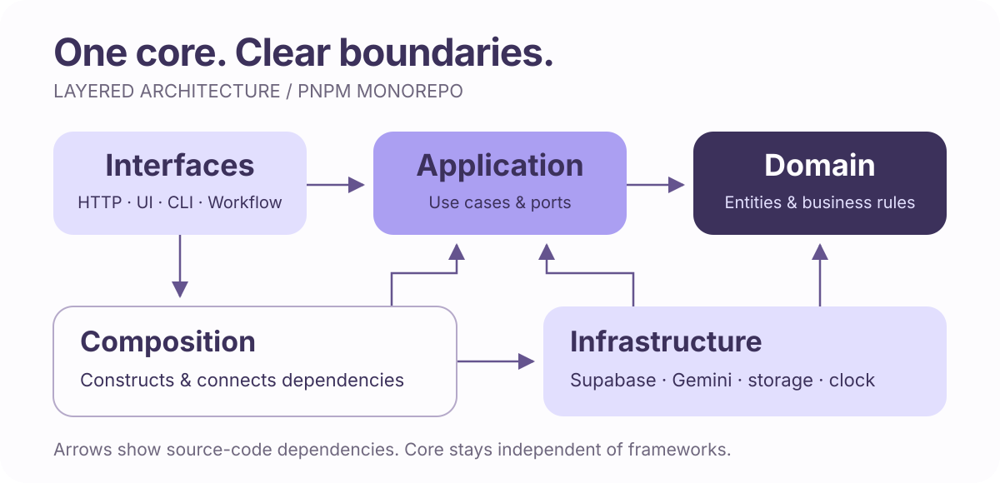

Domain is independent of Next.js, React, Supabase and platform APIs. Browser audio, DOM and IndexedDB stay in web adapters. Run `pnpm architecture:check` to verify import boundaries and detect dependency cycles.

| Path                                                 | Responsibility                                                       |
| ---------------------------------------------------- | -------------------------------------------------------------------- |
| [`apps/web`](apps/web)                               | Next.js, pages, HTTP, Auth and browser adapters.                     |
| [`apps/ios`](apps/ios)                               | SwiftUI screens, local demo scenarios, persistence and native tests. |
| [`apps/macos`](apps/macos)                           | Separate macOS starter project and platform resources.               |
| [`packages/backend`](packages/backend)               | Domain, Application, Infrastructure and Composition.                 |
| [`packages/contracts`](packages/contracts)           | Zod → OpenAPI 3.1: 46 operations under `/api/v1`.                    |
| [`packages/api-client`](packages/api-client)         | A typed TypeScript HTTP client.                                      |
| [`packages/design-tokens`](packages/design-tokens)   | Colours, typography, assets and Vey parameters.                      |
| [`packages/ui-web`](packages/ui-web)                 | The SVG character, motion, gaze and shared web models.               |
| [`tools/content-generator`](tools/content-generator) | A Python generator for practice materials.                           |
| [`tools/api-compatibility`](tools/api-compatibility) | Swift client generation and compilation from the contract.           |
| [`infra/supabase`](infra/supabase)                   | Database, Auth, Storage, SQL migrations and checks.                  |

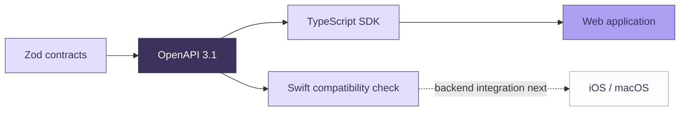
```mermaid
flowchart LR
    C[Zod contracts] --> O[OpenAPI 3.1]
    O --> T[TypeScript SDK]
    O --> S[Swift compatibility check]
    T --> W[Web application]
    S -. backend integration next .-> N[iOS / macOS]
    style C fill:#e2dffe,stroke:#65548e,color:#3c315b
    style O fill:#3c315b,stroke:#3c315b,color:#fdfcfe
    style T fill:#e2dffe,stroke:#65548e,color:#3c315b
    style S fill:#e2dffe,stroke:#65548e,color:#3c315b
    style W fill:#ab9ff2,stroke:#65548e,color:#3c315b
    style N fill:#fdfcfe,stroke:#b5a9c9,color:#3c315b
```

The iOS preview follows the same layer direction within its own app target: Domain, Application, Infrastructure, Interfaces and Composition. Its current adapters provide demo content and local JSON storage. iOS and macOS keep separate sources, resources and bundle identifiers inside one Xcode workspace. See the [native architecture decision](docs/adr/003-native-app-layers.md) and [native client contract](docs/adr/002-api-and-native-clients.md).

### iOS preview

Open [`apps/Veylo.xcworkspace`](apps/Veylo.xcworkspace) in **Xcode 27**, select **Veylo iOS**, and run on an **iOS 27** simulator with the runtime installed. The native preview does not require Node.js, Docker or a running server.

- **25 main screens:** demo sign-in and registration, five onboarding questions, plan confirmation, Home, Tests, Progress, Profile, Vocabulary, Vey AI and Arcade, plus practice and feedback screens.
- **Interactive practice:** Reading, Listening, Writing and Speaking, a short full demo exam, saved answers, writing drafts, sample results and detailed feedback.
- **Native presentation:** Nunito Sans, skill-specific colours, Liquid Glass controls, four independent tab histories and a plus menu for AI and Arcade.
- **Motion and accessibility:** shared press, selection and transition animations, charts, voice waveforms, Reduce Motion and Reduce Transparency support.
- **Local state:** profile, onboarding answers, drafts, results, vocabulary and game scores persist between launches. Profile settings can reset the demo.

Use **Continue with Google** to explore the returning learner demo, or **Create an account** to walk through onboarding with an empty learning history. Neither action creates a real account. Scores, forecasts, AI replies, playback and recording are demonstrations; no password is stored and no microphone or backend is used.

The editable source is [`design.pen`](design.pen). See the [iOS guide](apps/ios/README.md) for build commands and the [onboarding specification](docs/ios-onboarding.md) for the survey flow. The **Veylo macOS** scheme currently opens a starter screen.

## Tech stack

| Area                    | Technologies                                                                  |
| ----------------------- | ----------------------------------------------------------------------------- |
| Foundation              | Node.js 24 · pnpm 11 workspaces · TypeScript 5.9                              |
| Web                     | Next.js 16 App Router · React 19 · Tailwind CSS 4 · CSS · Radix UI            |
| Visualisation           | SVG · Recharts · React Flow · Phosphor / Lucide                               |
| Data and authentication | PostgreSQL 17 · Supabase Auth · private Supabase Storage                      |
| AI and background jobs  | Google Gemini · Workflow                                                      |
| Voice and local data    | Web Audio · VAD / ONNX · WAV PCM · IndexedDB                                  |
| API                     | Zod 4 · OpenAPI 3.1 · openapi-typescript · openapi-fetch                      |
| Python                  | Python 3.13 · uv · Pydantic · google-genai · Black · Ruff                     |
| Apple compatibility     | Swift 6.1+ · Swift OpenAPI Generator / Runtime / URLSession                   |
| Native iOS preview      | Xcode 27 · iOS 27 · SwiftUI · Swift Charts · Liquid Glass · XCTest / XCUITest |
| Quality                 | Vitest · Playwright · SQL · ESLint · Prettier · GitHub Actions                |

## Verification

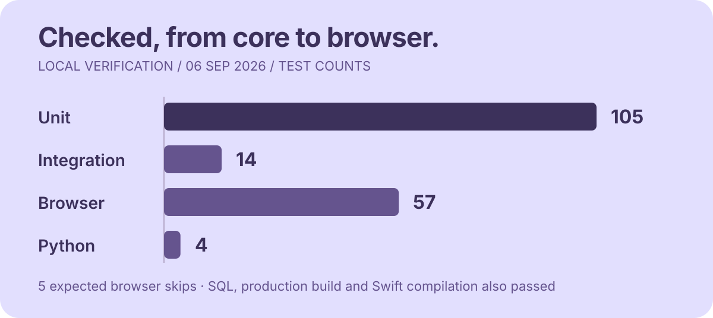

Local verification snapshot, **6 September 2026**: **105 unit**, **14 integration**, **57 browser** and **4 Python** tests passed, with **5 expected browser skips**. Two SQL suites, the production build, a clean installation and Swift compilation also passed. These are test counts, not coverage percentages. The Verify badge above shows the remote CI status. [Read the detailed report](docs/migration-report.md).

Native checks are separate from the web snapshot. The iOS project includes tests for onboarding rules, saved state, repeated attempts, forecast eligibility and font registration, plus UI tests for onboarding, practice, feedback, games, profile editing and navigation. Run them through the **Veylo iOS** scheme. The local iOS build and 15 unit tests passed on **7 September 2026**.

```sh
pnpm check
pnpm test:sql
pnpm test:integration
pnpm test:e2e
```

SQL checks require local Supabase; integration and E2E checks also need a running app. Before your first E2E run, install browsers with `pnpm exec playwright install chromium chrome webkit`. Audio tests use prepared recordings and AI stubs.

<details>
<summary><strong>Generation, Python, Swift and development rules</strong></summary>

| Command                                              | Purpose                                                        |
| ---------------------------------------------------- | -------------------------------------------------------------- |
| `pnpm api:generate`                                  | Update OpenAPI and the TypeScript SDK after a contract change. |
| `pnpm design:generate`                               | Update CSS and assets from shared design data.                 |
| `pnpm architecture:check`                            | Verify import directions and detect dependency cycles.         |
| `uv sync --project tools/content-generator --frozen` | Install the locked Python environment with uv.                 |
| `pnpm python:check`                                  | Run Black, Ruff, tests and the CLI check.                      |
| `pnpm swift:check`                                   | Generate and compile the client; requires Swift 6.1+.          |

Pre-commit checks formatting, layers, contracts, types and linting. Commit-msg enforces Conventional Commits. CI verifies that generated files match their source data. [Development guidelines](docs/contributing.md).

</details>

## Community

Please follow the [Code of Conduct](CODE_OF_CONDUCT.md) when participating in Veylo. It includes community standards and a private contact for reporting concerns.

## Documentation

| Understand the project                                          | Prepare for operations                                       |
| --------------------------------------------------------------- | ------------------------------------------------------------ |
| [Architecture and boundaries](docs/architecture.md)             | [Deployment and rollback](docs/runbooks/deployment.md)       |
| [API and Apple clients](docs/adr/002-api-and-native-clients.md) | [Backup and recovery](docs/runbooks/recovery.md)             |
| [iOS preview and local flows](apps/ios/README.md)               | [Native layer boundaries](docs/adr/003-native-app-layers.md) |
| [Veylo design system](docs/veylo-design-system.md)              | [Logs and diagnostics](docs/runbooks/observability.md)       |
| [Learning flame streaks](docs/daily-streak.md)                  | [Assessment quality](docs/assessment-quality.md)             |
| [README visual sources](assets/readme/README.md)                | [Migration report](docs/migration-report.md)                 |

Staging/production, branch protection and centralised metrics still need configuration. Publishing the repository does not deploy the website. A code licence has not been selected yet; third-party font licences are preserved alongside their assets.

<p align="center">
  <br>
  <strong>One practice. One flame. See you tomorrow.</strong><br>
  <a href="#how-to-install">Run Veylo locally</a>
</p>
