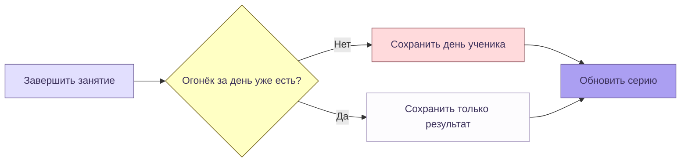
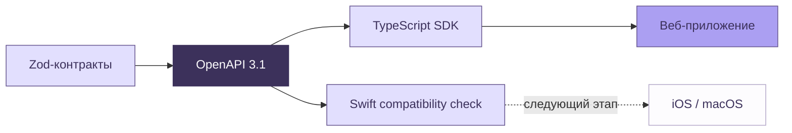

<p align="center">
  
</p>

<p align="center">
  <a href="https://github.com/Hqzdev/ielts-prep/actions/workflows/check.yml"></a>
  
  
  
</p>

<p align="center">
  <a href="#how-to-install">Установить</a> ·
  <a href="#внутри-veylo">Возможности</a> ·
  <a href="#архитектура">Архитектура</a> ·
  <a href="#стек">Стек</a> ·
  <a href="#документация">Документация</a>
</p>

**Veylo — рабочая среда для подготовки к IELTS Academic.** Решайте задания, сохраняйте черновики, тренируйте речь с Веем и возвращайтесь каждый день за новым огоньком. Веб-приложение уже работает локально; общие API-контракты и дизайн-данные подготовлены для будущих iOS и macOS.

<a href="assets/readme/reading-desktop.png"></a>

<sub>Реальный интерфейс, Chrome, тестовый аккаунт. Нажмите на скриншот, чтобы открыть его в полном размере.</sub>

## Внутри Veylo

| Раздел                | Что можно делать                                                                                                         |
| --------------------- | ------------------------------------------------------------------------------------------------------------------------ |
| **Practice**          | Выбирать Reading, Writing и Speaking; сохранять черновики, продолжать после перезагрузки и разбирать результаты Reading. |
| **Vey AI**            | Выбирать характер собеседника и практиковать разговор. Вей слушает, говорит, меняет выражение лица и следит за курсором. |
| **Vocabulary**        | Повторять слова по темам, проходить quiz и собирать личный словарь.                                                      |
| **Daily flame**       | Завершать занятия и поддерживать серию по своему часовому поясу.                                                         |
| **Progress & Arcade** | Следить за историей занятий и тренироваться в коротких игровых раундах.                                                  |

### Один Вей, разные характеры

<a href="assets/readme/vey-ai-desktop.png"></a>

<details>
<summary><strong>Ещё экраны: план дня, словарь и мобильная версия</strong></summary>

#### План и ежедневные огоньки


#### Словарь


<p align="center">
  
  
  
</p>

</details>

### Учебный банк


В репозитории **146 заданий: 46 Reading, 40 Writing и 60 Speaking**, а также **300 слов по 15 темам**. Reading охватывает 14 форматов вопросов. Это состав локального банка, а не статистика пользователей. [Проверка материалов](apps/web/scripts/validate-content.ts) проверяет структуру, ключи и подтверждающие цитаты.

### Как загорается огонёк



Подходят отправленная работа, quiz, завершённый игровой раунд или три содержательных ответа ученика в одном разговоре за день. Успешная AI-проверка для огонька не нужна. Пропуск целого дня сбрасывает текущую серию; лучший результат сохраняется. [Полные правила](docs/daily-streak.md).

## How to install

Нужны **Node.js 24.17.0**, **pnpm 11.19.0** и работающий **Docker Desktop или OrbStack**. Python, Swift и ключ Gemini для первого запуска не требуются.

```sh
git clone https://github.com/Hqzdev/ielts-prep.git
cd ielts-prep
pnpm install --frozen-lockfile
pnpm local:setup
pnpm dev
```

Откройте **[127.0.0.1:3000/login](http://127.0.0.1:3000/login)** → **Open local account** → **Tests** → **Reading**. Выберите задание и сохраните первый ответ.

`local:setup` запускает локальный Supabase, применяет миграции, импортирует задания и слова, создаёт `apps/web/.env.local`. Повторный запуск сохраняет существующие настройки и не дублирует банк. Быстрый локальный вход доступен только в development с локальной базой.

<details>
<summary><strong>AI, Google-вход и переменные окружения</strong></summary>

| Настройка                                                   | Для чего нужна                                                                               |
| ----------------------------------------------------------- | -------------------------------------------------------------------------------------------- |
| `GEMINI_API_KEY`                                            | Серверный доступ к Gemini для AI-функций.                                                    |
| `GOOGLE_CLIENT_ID`, `GOOGLE_CLIENT_SECRET`                  | Google OAuth в окружении Supabase; нужны собственные credentials и разрешённые callback URL. |
| `ASSESSMENT_WRITING_ENABLED`, `ASSESSMENT_SPEAKING_ENABLED` | Отдельное включение оценивания после экспертной калибровки.                                  |

Перечень настроек — в [apps/web/.env.example](apps/web/.env.example). Секреты храните в локальном окружении; файл `.env.local` исключён из Git.

Без Gemini доступны сохранение работ и записей, Reading, словарь и серия занятий. Writing/Speaking-оценивание остаётся закрытым флагами до проверки качества. Оценки Reading являются оценочными; это не официальный результат IELTS.

Для новой настройки Google следуйте [инструкции окружений](docs/runbooks/deployment.md). Локальный запуск не требует Google OAuth.

</details>

## Архитектура

**Монорепозиторий со слоистой архитектурой.** Основное направление зависимостей: **Interfaces → Application → Domain**. Infrastructure реализует порты Application, а Composition собирает сценарии и адаптеры.


Domain не знает о Next.js, React, Supabase и платформенных API. Браузерные аудио, DOM и IndexedDB остаются в веб-адаптерах. Границы импортов и циклы проверяет `pnpm architecture:check`.

| Путь                                                 | Ответственность                                      |
| ---------------------------------------------------- | ---------------------------------------------------- |
| [`apps/web`](apps/web)                               | Next.js, страницы, HTTP, Auth и браузерные адаптеры. |
| [`packages/backend`](packages/backend)               | Domain, Application, Infrastructure и Composition.   |
| [`packages/contracts`](packages/contracts)           | Zod → OpenAPI 3.1: 46 операций `/api/v1`.            |
| [`packages/api-client`](packages/api-client)         | Типизированный TypeScript HTTP-клиент.               |
| [`packages/design-tokens`](packages/design-tokens)   | Цвета, типографика, ассеты и параметры Вея.          |
| [`packages/ui-web`](packages/ui-web)                 | SVG-персонаж, движение, взгляд и общие веб-модели.   |
| [`tools/content-generator`](tools/content-generator) | Python-генератор учебных материалов.                 |
| [`tools/api-compatibility`](tools/api-compatibility) | Генерация и компиляция Swift-клиента по контракту.   |
| [`infra/supabase`](infra/supabase)                   | База, Auth, Storage, SQL-миграции и проверки.        |



**Приложения iOS и macOS пока не созданы.** Для них подготовлены API, Bearer-авторизация и общие дизайн-данные; совместимость Swift-клиента проверяется компиляцией. Подробнее: [решение об архитектуре](docs/adr/001-layered-monorepo.md) и [контракт для native-клиентов](docs/adr/002-api-and-native-clients.md).

## Стек

| Область                  | Технологии                                                         |
| ------------------------ | ------------------------------------------------------------------ |
| Основа                   | Node.js 24 · pnpm 11 workspaces · TypeScript 5.9                   |
| Web                      | Next.js 16 App Router · React 19 · Tailwind CSS 4 · CSS · Radix UI |
| Визуализация             | SVG · Recharts · React Flow · Phosphor / Lucide                    |
| Данные и вход            | PostgreSQL 17 · Supabase Auth · приватный Supabase Storage         |
| AI и фоновые задачи      | Google Gemini · Workflow                                           |
| Голос и локальные данные | Web Audio · VAD / ONNX · WAV PCM · IndexedDB                       |
| API                      | Zod 4 · OpenAPI 3.1 · openapi-typescript · openapi-fetch           |
| Python                   | Python 3.13 · uv · Pydantic · google-genai · Black · Ruff          |
| Совместимость Apple      | Swift 6.1+ · Swift OpenAPI Generator / Runtime / URLSession        |
| Качество                 | Vitest · Playwright · SQL · ESLint · Prettier · GitHub Actions     |

## Проверки


Срез локального прогона **06.09.2026**: **105 unit**, **14 integration**, **57 browser**, **4 Python** теста пройдены; **5 браузерных тестов штатно пропущены**. Дополнительно пройдены 2 SQL-набора, сборка, чистая установка и Swift-компиляция. Это количество проверок, а не процент покрытия. Удалённый статус всегда показывает бейдж Verify выше. [Подробный отчёт](docs/migration-report.md).

```sh
pnpm check
pnpm test:sql
pnpm test:integration
pnpm test:e2e
```

SQL требует локальный Supabase; integration и E2E — также запущенное приложение. Перед первым E2E установите браузеры: `pnpm exec playwright install chromium chrome webkit`. Аудиотесты используют подготовленные записи и заглушки AI.

<details>
<summary><strong>Генерация, Python, Swift и правила разработки</strong></summary>

| Команда                                              | Назначение                                                   |
| ---------------------------------------------------- | ------------------------------------------------------------ |
| `pnpm api:generate`                                  | Обновить OpenAPI и TypeScript SDK после изменения контракта. |
| `pnpm design:generate`                               | Обновить CSS и ресурсы из общих дизайн-данных.               |
| `pnpm architecture:check`                            | Проверить направления импортов и отсутствие циклов.          |
| `uv sync --project tools/content-generator --frozen` | Установить закреплённое Python-окружение через uv.           |
| `pnpm python:check`                                  | Выполнить Black, Ruff, тесты и проверку CLI.                 |
| `pnpm swift:check`                                   | Сгенерировать и скомпилировать клиент; нужен Swift 6.1+.     |

Pre-commit проверяет формат, слои, контракт, типы и линтеры. Commit-msg проверяет Conventional Commits. CI сверяет сгенерированные файлы с исходными данными. [Правила разработки](docs/contributing.md).

</details>

## Документация

| Разобраться в устройстве                                      | Подготовить эксплуатацию                             |
| ------------------------------------------------------------- | ---------------------------------------------------- |
| [Архитектура и границы](docs/architecture.md)                 | [Деплой и откат](docs/runbooks/deployment.md)        |
| [API и Apple-клиенты](docs/adr/002-api-and-native-clients.md) | [Резервное копирование](docs/runbooks/recovery.md)   |
| [Дизайн-система Veylo](docs/veylo-design-system.md)           | [Логи и диагностика](docs/runbooks/observability.md) |
| [Серия огоньков](docs/daily-streak.md)                        | [Качество оценивания](docs/assessment-quality.md)    |
| [Происхождение README-графики](assets/readme/README.md)       | [Отчёт о миграции](docs/migration-report.md)         |

Staging/production, branch protection и централизованные метрики ещё требуют настройки. Публикация репозитория не разворачивает сайт. Отдельная лицензия на код пока не выбрана; лицензии сторонних шрифтов сохранены рядом с ассетами.

<p align="center">
  <br>
  <strong>One practice. One flame. See you tomorrow.</strong><br>
  <a href="#how-to-install">Запустить Veylo локально</a>
</p>
