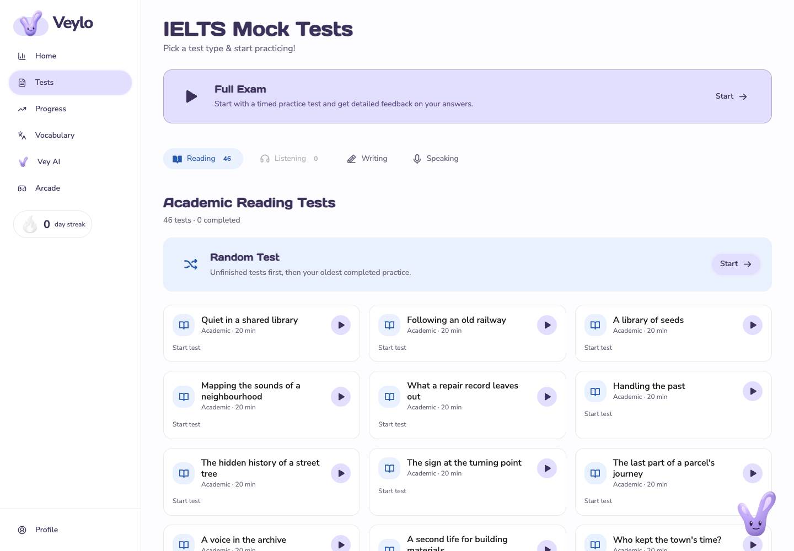
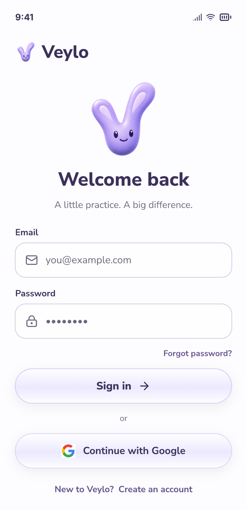
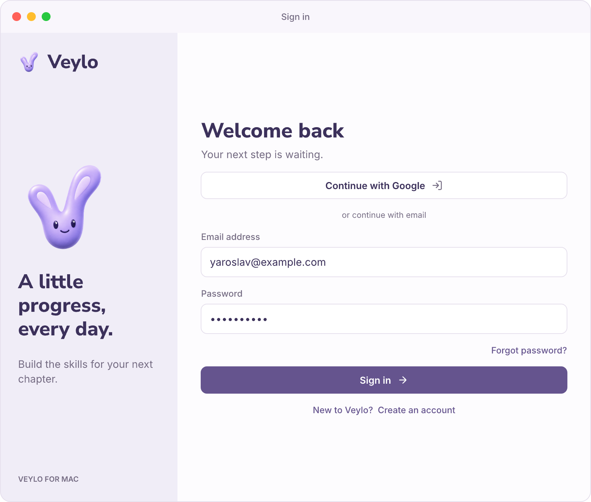
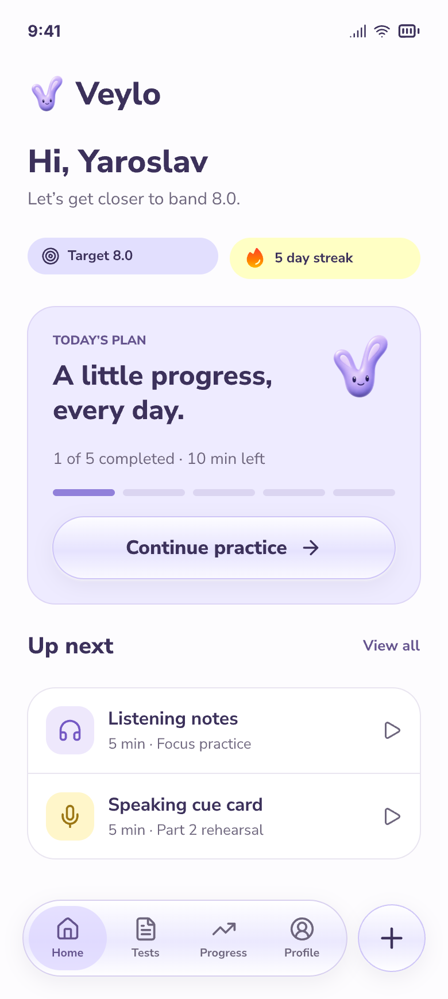
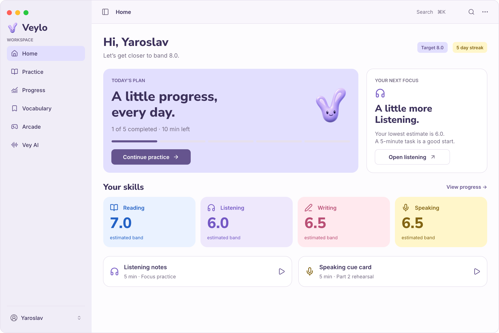
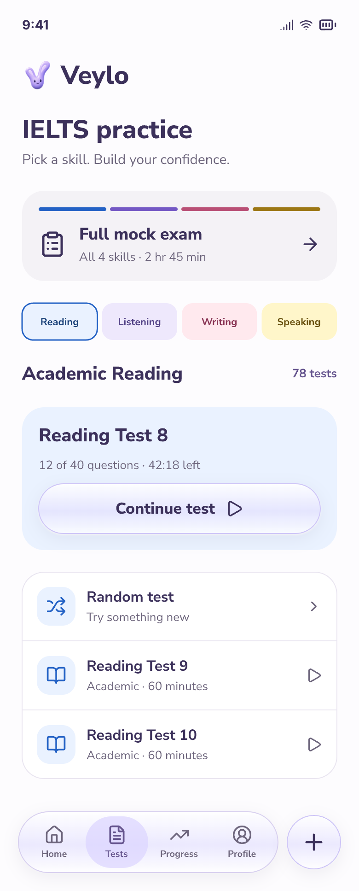
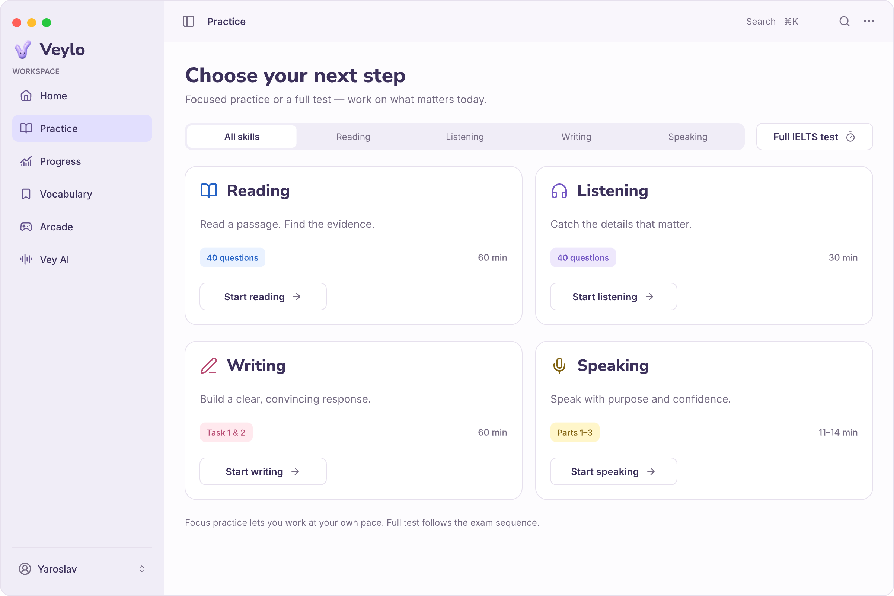

  

  <a href="#how-to-install">Install</a> ·
  <a href="#inside-veylo">Features</a> ·
  <a href="#iphone-and-mac-designs">iPhone & Mac designs</a> ·
  <a href="#ios-app">iOS app</a> ·
  <a href="#architecture">Architecture</a> ·
  <a href="#tech-stack">Tech stack</a> ·
  <a href="#documentation">Documentation</a>

**Veylo is a workspace for IELTS Academic preparation.** Practise with tasks, save drafts, build speaking confidence with Vey, and return each day to earn another flame. The repository includes a web app and a SwiftUI iPhone app connected to the shared backend. iOS exposes Reading, Writing, text tutoring, vocabulary and Word Sprint; its AI uses GigaChat while the web app keeps Gemini. macOS has a separate starter project.

Real interface, Chrome, test account. Click a screenshot to view it at full size.

## iPhone and Mac designs

Five matching screen pairs exported from [`design.pen`](design.pen). Click either image for the full-size view.

### Sign in

Email and Google sign-in, password recovery and a familiar welcome from Vey.

<table>
  <tr><th width="25%">iPhone</th><th width="75%">macOS</th></tr>
  <tr>
    <td valign="top"></td>
    <td valign="top"></td>
  </tr>
</table>

### Dashboard

A daily study plan, a target band and a learning streak. Mac adds room for skill estimates and the next recommended task.

<table>
  <tr><th width="25%">iPhone</th><th width="75%">macOS</th></tr>
  <tr>
    <td valign="top"></td>
    <td valign="top"></td>
  </tr>
</table>

### Practice

Choose a skill and start practising. iPhone uses a compact catalogue; Mac presents the skill areas in a wider workspace.

<table>
  <tr><th width="25%">iPhone</th><th width="75%">macOS</th></tr>
  <tr>
    <td valign="top"></td>
    <td valign="top"></td>
