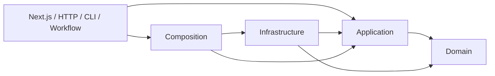

# ADR 001: слоистая архитектура в монорепозитории

Дата: 2026-09-06. Статус: принято пользователем.

## Решение

Veylo остаётся модульным серверным монолитом. pnpm workspaces объединяет приложение и TS-пакеты. Python и Swift имеют собственные lockfile и инструменты. Дополнительный оркестратор сборок и микросервисы сейчас не нужны.

Domain содержит чистые сущности и правила. Application организует сценарии и объявляет порты. Infrastructure реализует порты через Supabase, Gemini, часы, криптографические идентификаторы и файловое хранилище. Composition создаёт зависимости и передаёт их через конструкторы. Next.js Route Handlers, страницы, CLI и Workflow — внешние адаптеры.

Стрелки означают зависимости исходного кода. Во время выполнения application вызывает переданные реализации портов. Сценарий не создаёт Supabase-клиент и не читает переменные окружения.

## Последствия

Бизнес-правила тестируются без Next.js и базы. Роль PostgreSQL сохраняется: блокировки, RLS, уникальность и атомарные RPC защищают данные от конкурентной записи. Копирование этих ограничений только в TypeScript не заменяет SQL.

Границы проверяет `pnpm architecture:check`: запрещённые импорты, платформенные символы внутри core, обратные зависимости пакетов на приложение и циклы исполнения. Публичные exports пакета ограничивают доступные входы. Проверки типов контрактов находятся в тестах backend, поэтому пакет contracts не зависит от бизнес-кода.

React-компоненты остаются функциональными; сценарии, контроллеры и адаптеры используют композицию классов. Причины решений записываются в ADR. В собственном коде нет поясняющих комментариев; обязательные директивы инструментов, например shebang и Swift tools version, являются синтаксисом запуска.
